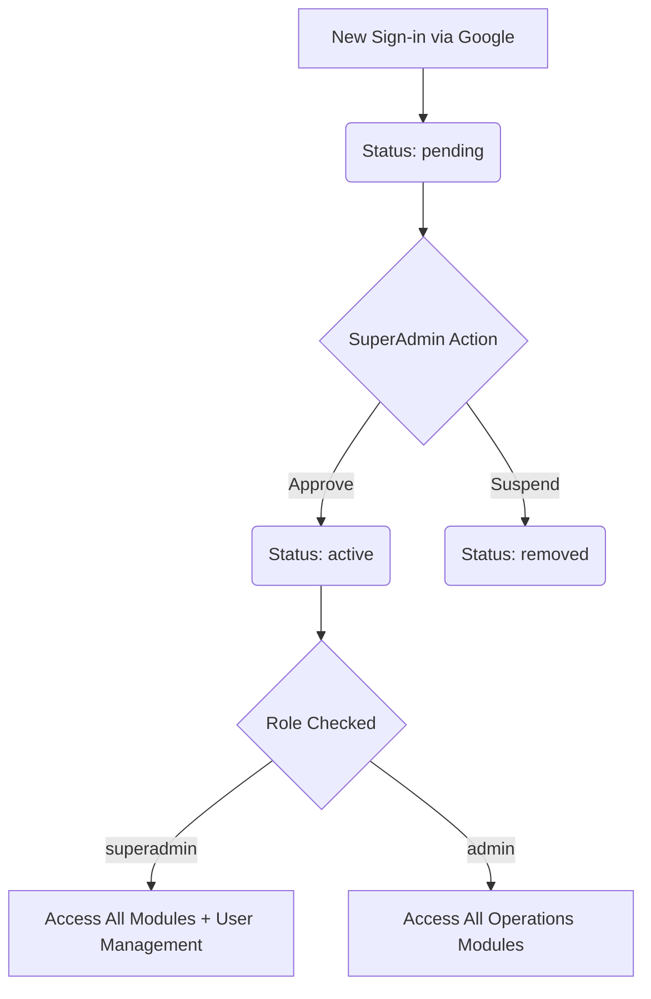
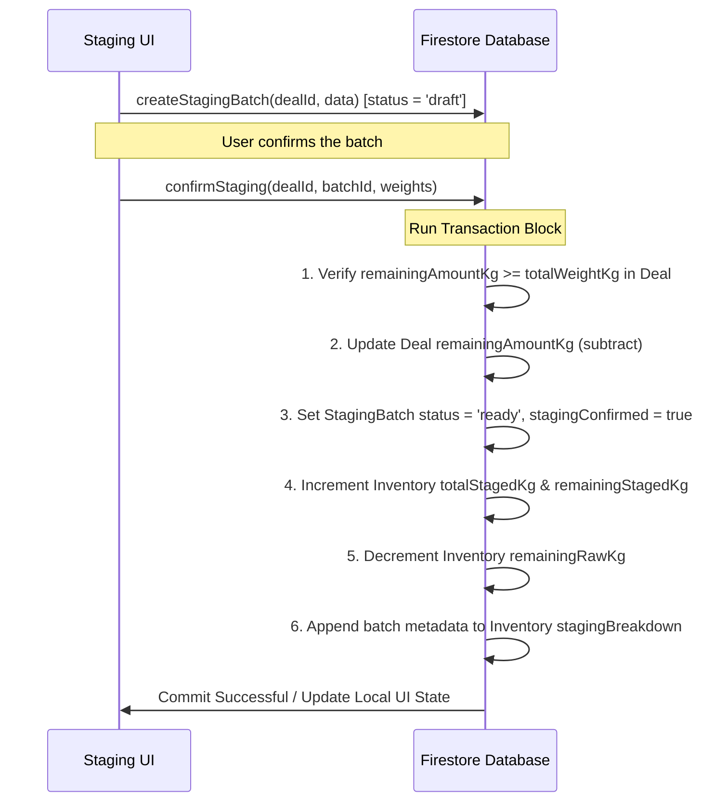
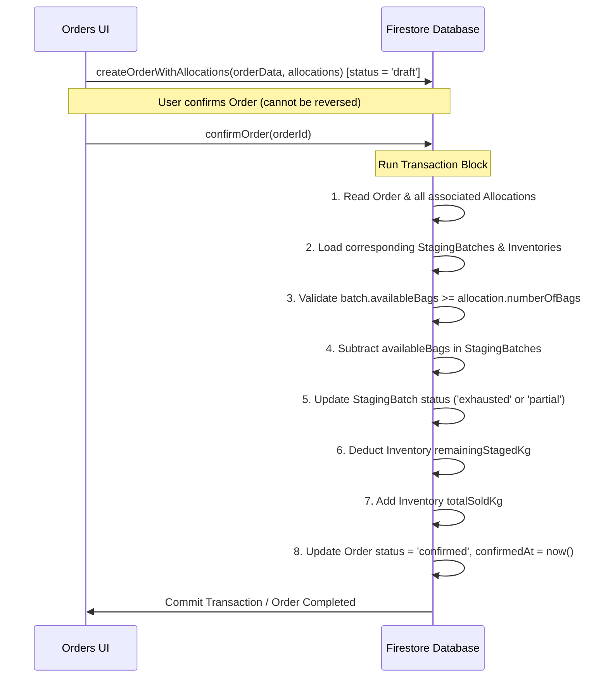

# Rice Merchant ERP (rice-erp) - Detailed Summary

A state-of-the-art, premium Enterprise Resource Planning (ERP) application custom-built for **Rice Merchants, Traders, and Mill Operators**. The application provides complete tracking of the rice lifecycle: purchasing raw grain from suppliers, managing the processing/milling (staging) stage, selling finished bags to customers, tracking inventory across multiple states (raw, staged, and sold), calculating profit/loss on a per-deal basis, processing employee wages, and managing security roles via a robust administration panel.

---

## 🛠️ Technology Stack

The project features a modern, performant, and fully decoupled tech stack that leverages cloud-based serverless resources for security, scalability, and speed.

| Layer | Technology | Details / Purpose |
| :--- | :--- | :--- |
| **Core Framework** | **React 18** | Handles component-driven UI rendering and state-driven DOM updates. |
| **Routing** | **React Router DOM v7** | Client-side routing with route guarding for auth and permissions. |
| **Build Tool** | **Vite 8** | High-performance bundling and fast hot module replacement (HMR). |
| **Language** | **TypeScript 5** | Strict type definitions ensuring compile-time safety across business models. |
| **Database** | **Firebase Firestore** | NoSQL document database used for real-time data sync and transaction isolation. |
| **Authentication** | **Firebase Auth** | Handles secure user sign-in via Google Authentication. |
| **Styling** | **Tailwind CSS v3** | Utility-first styling supplemented with custom animations and variables. |
| **State Management** | **Zustand v5** | Lightweight, fast global store for authentication status and UI states. |
| **Charts / Viz** | **Recharts v3** | Renders dynamic dashboards with interactive trendlines and legends. |
| **Form Handling** | **React Hook Form v7** | Manages form state, submission lifecycle, and input performance. |
| **Validation** | **Zod v4** | Schema definitions and runtime validation for form payloads. |
| **PDF Generation** | **@react-pdf/renderer** | Generates pixel-perfect PDF client invoices directly in the browser. |

---

## 📁 Project Architecture & Directory Structure

The repository follows clean design principles, separating business models, service layers, global state, and visual elements.

```
c:/dev/ERP/rice-erp/
├── firestore.rules              # Firebase security rules (access control by user status/role)
├── package.json                 # Project dependencies & npm scripts
├── tailwind.config.ts           # Design system configuration (colors, font, animations)
├── vite.config.mts              # Vite builder setup (plugin definitions, path aliases)
└── src/
    ├── App.tsx                  # Client router & page route definitions
    ├── main.tsx                 # Web entry point & application bootloader
    ├── globals.css              # Core styling, fonts, and scrollbars
    ├── lib/                     # Firebase credentials, utilities, and constants
    ├── types/                   # TypeScript interfaces (Supplier, Deal, Order, etc.)
    ├── stores/                  # Zustand global stores (authStore, uiStore)
    ├── services/                # Database abstraction layer (Firestore integration)
    ├── pages/                   # Route-level containers wrapping component page views
    └── components/              # Modular UI components separated by functional domain
        ├── admin/               # SuperAdmin user-management components
        ├── auth/                # Sign-in and authentication providers
        ├── dashboard/           # Metrics cards, charts, and ledger quick-views
        ├── deals/               # Complex forms, cards, and sub-tabs for trading
        ├── inventory/           # Visual stock indicators (raw, staged, sold)
        ├── layout/              # Sidebar navigation, Top bar, and App shell wrappers
        ├── ledger/              # Ledger logs, detail breakdowns, and financials
        ├── pdf/                 # React-PDF templates for digital invoices
        ├── ui/                  # Shadcn reusable primitives (Dialog, Tabs, Card, etc.)
        └── wages/               # Employee registry, payroll logs, and pay modal
```

---

## 🔐 Authentication, Authorization & Roles

The system protects sensitive financial data using a three-tier user lifecycle enforced via **Firebase Auth** on the client and **Firestore Security Rules** on the database.



### 1. User States (`status`)
*   **Pending**: Default state for new registrations. Users are locked to a `/pending` waiting room and cannot read/write any database collection.
*   **Active**: Approved by a SuperAdmin. Grays out the login barrier and opens the operational dashboard.
*   **Removed**: Suspended accounts. Stripped of database query permissions.

### 2. User Roles (`role`)
*   **Admin**: Standard business operators. Can manage suppliers, deals, inventory, sales, and employee payroll.
*   **SuperAdmin**: Inherits all Admin capabilities + unlocks the `/admin/users` panel to approve pending accounts, suspend active users, and promote administrators to SuperAdmins.

---

## 🗃️ Database Schema & Data Models

### `users` (Collection)
Stores access profile mappings:
```typescript
interface AppUser {
  uid: string;
  email: string | null;
  displayName: string | null;
  photoURL: string | null;
  role: "superadmin" | "admin";
  status: "pending" | "active" | "removed";
  createdAt: Timestamp;
  updatedAt: Timestamp;
}
```

### `suppliers` & `customers` (Collections)
```typescript
interface Supplier / Customer {
  supplierId / customerId: string;
  name: string;
  description: string;
  contactPhone?: string;
  contactEmail?: string;
  address?: string;
  createdAt: Timestamp;
  createdBy: string;
  updatedAt: Timestamp;
}
```

### `deals` (Collection) & `stagingBatches` (Subcollection)
Deals represent purchasing raw rice. StagingBatches represent processing raw rice into bags.
```typescript
interface Deal {
  dealId: string;
  supplierId: string;
  supplierName: string;
  productName: string;
  totalAmountKg: number;
  remainingAmountKg: number;
  pricePerKg: number;
  totalCost: number;
  purchaseDate: Timestamp;
  deliveryConfirmed: boolean;
  deliveryDate: Timestamp | null;
  status: "pending_delivery" | "delivered" | "staging" | "completed";
  notes?: string;
  createdAt: Timestamp;
  createdBy: string;
  updatedAt: Timestamp;
}

interface StagingBatch {
  batchId: string;
  dealId: string;
  bagSizeKg: number;
  numberOfBags: number;
  totalWeightKg: number;
  pricePerBag: number;
  availableBags: number;
  stagingConfirmed: boolean;
  stagingDate: Timestamp | null;
  status: "draft" | "ready" | "partial" | "exhausted";
  createdAt: Timestamp;
  updatedAt: Timestamp;
}
```

### `orders` (Collection) & `allocations` (Subcollection)
```typescript
interface Order {
  orderId: string;
  customerId: string;
  customerName: string;
  orderDate: Timestamp;
  totalQuantityQuintal: number;
  totalWeightKg: number;
  sellingPricePerQuintal: number;
  totalRevenue: number;
  totalCostOfGoods: number;
  profit: number;
  orderConfirmed: boolean;
  confirmedAt: Timestamp | null;
  status: "draft" | "confirmed" | "delivered";
  notes?: string;
  createdAt: Timestamp;
  createdBy: string;
  updatedAt: Timestamp;
}

interface OrderAllocation {
  allocationId: string;
  dealId: string;
  batchId: string;
  bagSizeKg: number;
  numberOfBags: number;
  weightKg: number;
  costPerBag: number;
  totalCost: number;
  createdAt: Timestamp;
}
```

### `inventory` (Collection)
Consolidates raw vs. processed stock figures for quick querying:
```typescript
interface Inventory {
  inventoryId: string; // Maps 1:1 to dealId
  dealId: string;
  supplierId: string;
  supplierName: string;
  productName: string;
  totalBoughtKg: number;
  totalStagedKg: number;
  totalSoldKg: number;
  remainingRawKg: number;
  remainingStagedKg: number;
  purchasePricePerKg: number;
  stagingBreakdown: {
    batchId: string;
    bagSizeKg: number;
    numberOfBags: number;
    availableBags: number;
    pricePerBag: number;
  }[];
  lastUpdated: Timestamp;
  status: "in_stock" | "partial" | "exhausted";
}
```

---

## 💼 Core Business Logic & Transaction Workflows

Data integrity is vital in accounting. The application isolates stock adjustments inside **Firestore Transactions** to guarantee calculations remain consistent even under concurrent usage.

### Workflow A: Raw Deal Staging
When raw grain is packaged into specific bag sizes (e.g., 25kg, 50kg bags):


### Workflow B: Sales Order Confirmation
When client orders are finalized, bags are deducted from available batches and mapped directly back to their source purchase deals:


---

## 💎 Features & Functional Modules

### 1. Executive Dashboard (`DashboardPage`)
*   **Financial KPIs**: Highlights Total Revenue, Net Profit, Staged Stock, and Raw Stock using stylized visual panels.
*   **Visual Trends**: Embeds a dual-line spline chart (using Recharts) tracking daily Revenue vs. Profit progression.
*   **Recent Activity**: Lists the 5 most recent sales orders alongside direct shortcuts to their general ledger detail screens.

### 2. Trading Hub (`DealsPage`)
*   **Purchasing (Bought)**: Handles vendor contacts and logs bulk raw material purchases.
    *   *Supplier Registry*: Complete CRM for adding and viewing raw suppliers.
    *   *Confirm Delivery*: Once grain arrives, clicking "Confirm" issues an active inventory card.
*   **Milling (Staging)**: Packages bulk loose grains into retail-ready bags.
    *   Allows multiple concurrent packaging batches (e.g. staging 5,000kg into one batch of 50kg bags and another of 25kg bags).
*   **Sales (Sold)**: Handles customer relationships and registers outgoing client shipments.
    *   *Dynamic Allocation*: The Order Form checks available staging batches dynamically, allowing the operator to select which specific batches of rice are being sold to satisfy the order quantity.
    *   Calculates profit margins dynamically based on exact purchase prices (Cost of Goods Sold) vs. selling prices.

### 3. Real-Time Stock Room (`InventoryPage`)
*   **Dynamic Bars**: Displays progress bars visualizing the ratio of Raw vs. Staged vs. Sold material per deal.
*   **Stock Tracking**: Displays quantitative cards split into loose raw weight, packaged bag counts, and total bulk sold.
*   **Depletion Tagging**: Automates tags for current stock status (`in_stock`, `partial`, `exhausted`).

### 4. General Ledger & Invoicing (`LedgerPage` & `LedgerDetailPage`)
*   **Financial Log**: Centralized index of all historical verified transactions.
*   **COGS Breakdown**: Breaks down every line item in an order to show exactly which batch and supplier it came from, highlighting individual allocation costs.
*   **Invoice Generator**: Integrates PDF client invoicing. Users can download structured billing receipts in PDF format with a single click.

### 5. Wages & Workforce Management (`WagesPage`)
*   **Staff Registry**: Maintains employee lists with tags distinguishing `monthly` contract workers from `daily` wage workers.
*   **Wage Disbursement Log**: Records days worked, salary amounts, pay schedules, and payment history to track internal labor costs.

---

## 📈 Summary of File Locations & Key Symbols

If you are modifying or integrating with this application, use this reference index:

*   **Auth Store & Protected Router**:
    *   [authStore.ts](file:///c:/dev/ERP/rice-erp/src/stores/authStore.ts) - Global auth state.
    *   [AuthProvider.tsx](file:///c:/dev/ERP/rice-erp/src/components/auth/AuthProvider.tsx) - Enforces route limits.
    *   [ProtectedRoute.tsx](file:///c:/dev/ERP/rice-erp/src/components/layout/ProtectedRoute.tsx) & [SuperAdminRoute.tsx](file:///c:/dev/ERP/rice-erp/src/components/layout/SuperAdminRoute.tsx) - Blocks unauthorized URLs.
*   **Database Services**:
    *   [dealService.ts](file:///c:/dev/ERP/rice-erp/src/services/dealService.ts) - Buying deals & confirming delivery.
    *   [stagingService.ts](file:///c:/dev/ERP/rice-erp/src/services/stagingService.ts) - Processing & staging batches.
    *   [orderService.ts](file:///c:/dev/ERP/rice-erp/src/services/orderService.ts) - Order registration & transaction confirmations.
    *   [ledgerService.ts](file:///c:/dev/ERP/rice-erp/src/services/ledgerService.ts) - Ledger analytics & cost queries.
    *   [employeeService.ts](file:///c:/dev/ERP/rice-erp/src/services/employeeService.ts) - Staff logs & payments.
*   **Main Operations Views**:
    *   [DashboardPage.tsx](file:///c:/dev/ERP/rice-erp/src/components/dashboard/DashboardPage.tsx) - KPIs & trend chart.
    *   [DealsPage.tsx](file:///c:/dev/ERP/rice-erp/src/pages/app/DealsPage.tsx) - Deals dashboard wrapper.
    *   [InventoryPage.tsx](file:///c:/dev/ERP/rice-erp/src/pages/app/InventoryPage.tsx) - Visual stock meters.
    *   [LedgerPage.tsx](file:///c:/dev/ERP/rice-erp/src/pages/app/LedgerPage.tsx) - Ledger list.
    *   [LedgerDetailPage.tsx](file:///c:/dev/ERP/rice-erp/src/pages/app/LedgerDetailPage.tsx) - COGS summary & invoice download button.
